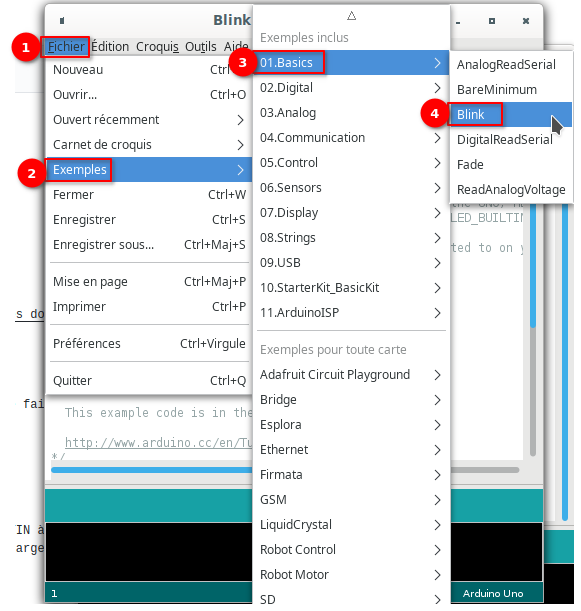
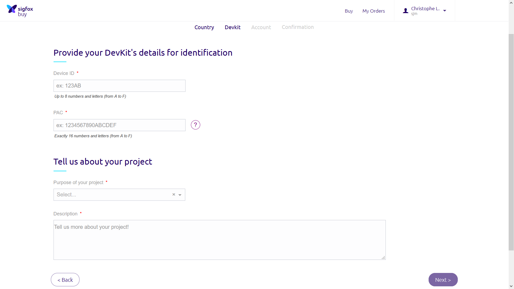

# Protocole d’installation du Sigfox
## Table des matières
1. [Lien](#1-lien)
2. [Installation du programme](#2-installation-du-programme)
	1. [Télécharger](#21-télécharger)
	2. [Configurer](#22-configurer)
		1. [Ajouter le noyau SAMD Core](#221-ajouter-le-noyau-samd-core)
		2. [Ajouter les librairies](#222-ajouter-les-librairies)
		3. [Selectionner le type de carte et le port](#223-selectionner-le-type-de-carte-et-le-port)
	3. [Votre premier croquis](#23-votre-premier-croquis)
	4. [Tutoriels](#24-tutoriels)
	5. [Notes importantes](#25-notes-importantes)
3. [Réglage du taux de transfert des données](#3-Réglage-du-taux-de-transfert-des-données)
4. [Création d'un compte SIGFOX](#4-Création-dun-compte-SIGFOX)

## 1. Lien
Site officiel arduino 
- https://www.arduino.cc/en/Guide/MKRFox1200
- https://www.arduino.cc/en/software

Tuto en anglais sur l’installation du microcontroller
- https://www.disk91.com/2018/technology/sigfox/introduction-to-arduino-mkrfox1200-part-1/
- https://www.disk91.com/2018/technology/internet-of-things-technology/introduction-to-arduino-mkrfox1200-part-2/

Inscription du micro-controller
- https://buy.sigfox.com/activate/devkit/FR

Backend Sigox : réception des données
- https://backend.sigfox.com/welcome/news

## 2. Installation du programme
Le logicial Arduino IDE fera l'interface entre votre ordinateur portable et l'Arduino.
Il sert à programmer et à téléverser le programme dans le système et aussi à afficher les données

### 2.1 Télécharger
Vous pouvez le télécharger depuis https://www.arduino.cc/en/software

Ou choisir votre programme selon votre système (/!\ Attention, les liens ci-dessous ne sont peut-être plus à jour):
- Windows 7: [Executable (.exe)](https://downloads.arduino.cc/arduino-1.8.13-windows.exe) ou [Archive (.zip)](https://downloads.arduino.cc/arduino-1.8.13-windows.zip)
- [Windows app 8.1 or 10](https://www.microsoft.com/store/apps/9nblggh4rsd8?ocid=badge)
- [Linux 64 bits](https://downloads.arduino.cc/arduino-1.8.13-linux64.tar.xz)
- [Mac OS X](https://downloads.arduino.cc/arduino-1.8.13-macosx.zip) (10.10 ou plus récent)
 
### 2.2 Configurer
#### 2.2.1 Ajouter le noyau SAMD Core
Si vous souhaitez programmer votre MKRFOX1200 hors ligne depuis le logiciel Arduino IDE, vous devez y ajouter le noyau __SAMD Core__. 

Une fois l'application Arduino IDE installé, 
- selectionner le menu __Outils (Tools)__, 
- puis __Type de cartes (Boards)__,
- __Gestionnaire de cartes (Boards Manager)__
- Rechercher __MKRFox__
- Cliquer sur __Installer__

 

Pour plus d'informations sur les noyaux, consultez le guide sur l'[installation de noyaux Arduino supplémentaires](https://www.arduino.cc/en/guide/cores).

#### 2.2.2 Ajouter les librairies
Maintenant il faut télécharger et installer les librairies que j'ai utilisées pour compiler le programme:

Les librairies se trouvent dans l'archive [librairies.zip](https://www.dropbox.com/sh/i5s8ciy7g694kg1/AAD1p8ZgO66AvzONasxKT_Pza/libraries/libraries.zip?dl=1) (protégé par mot de passe)

Une fois téléchargé, copier le contenu du ZIP dans un dossier qu'on nomme _emplacement du carnet de croquis_, par exemple dans  __D:\Arduino__ (cf. ci dessous)

Cliquer droit sur l'archive librairies.zip et faites extraire le contenu.

De retour dans le logiciel Aduino IDE; 

- Aller dans __Fichier__ 
- __Préférences__


- Puis coller (ou faire _Parcourir_) le chemin précédent (D:\Arduino) dans le champ __«Emplacement du carnet de croquis»__


Cocher __OK__

Les libraires sont maintenant installées.

Maintenant que le noyau __SAMD Core__ est installé ainsi que les librairies, vous pouvez connecter la carte à l'ordinateur à l'aide d'un câble USB standard. La toute première fois que votre ordinateur peut passer par le nouveau processus d'installation du matériel.

#### 2.2.3 Selectionner le type de carte et le port

Sélectionnez votre type de carte:
- Dans __Outils (Tools)__

- __Type de carte (Boards)__

- Selectionez la carte __Arduino MKRFOX1200__

 

Selectionnez votre port:

- Dans __Outils (Tools)__

- __Port__

- Selectionner le port connecté à votre Arduino MKRFOX1200 (cf [Réglage du taux de transfert des données](#3-Réglage-du-taux-de-transfert-des-données))

 

### 2.3 Votre premier croquis
Ouvrez votre premier croquis __Blink__
Ce croquis fait simplement clignoter la LED intégrée connectée à la broche numérique LED_BUILTIN à un rythme d'une seconde pour allumer et éteindre, mais il est très utile de pratiquer le chargement d'un croquis dans le logiciel Arduino (IDE) et le téléchargement sur la carte connectée.

Toujours dans le logiciel Arduino IDE;
- Rendez-vous dans __Fichier__
- puis __Exemple__
- puis sélectionnez __01. Basique__ 
- puis __Blink__

 


Vérifier (1er bouton) 
 

Puis Téléverser (2ième bouton ou Ctrl + U) votre premier programme :
 

### 2.4 Tutoriels

Maintenant que vous avez configuré et programmé votre carte MKRFOX1200, vous pouvez trouver l'inspiration dans la [plateforme de didacticiels](https://create.arduino.cc/projecthub?by=part&part_id=40679).

Voici une liste de tutoriels qui vous aideront à faire des choses très cool!

- [SigFox First Configuration](https://www.arduino.cc/en/Tutorial/SigFoxFirstConfiguration)
- [SigFox Event Trigger](https://www.arduino.cc/en/Tutorial/SigFoxEventTrigger)
- [Ajout d'interfaces série supplémentaires aux microcontrôleurs SAMD](https://www.arduino.cc/en/Tutorial/SamdSercom)

Plus d'exemples sur les pages de bibliothèque suivantes:

- [Planificateur](https://www.arduino.cc/en/Reference/Scheduler) - Gérez plusieurs tâches non bloquantes.
- [AudioFrequencyMeter](https://www.arduino.cc/en/Reference/AudioFrequencyMeter) - Échantillonnez un signal audio et récupérez sa fréquence
- [AudioZero](https://www.arduino.cc/en/Reference/AudioZero) - Lisez des fichiers audio à partir d'une carte SD.
- [RTC](https://www.arduino.cc/en/Reference/RTC) - Horloge en temps réel pour planifier des événements.
- [I2S](https://www.arduino.cc/en/Reference/I2S) - Pour connecter des appareils audio numériques ensemble
- [SigFox](https://www.arduino.cc/en/Reference/SigFox) - Pour utiliser la connectivité SigFox

### 2.5 Notes importantes
Dans cette section, nous avons rassemblé des informations qui valent la peine d'être lues pour utiliser correctement votre carte MKRFOX1200. 
Certains comportements diffèrent de la carte Uno et si vous venez d'une expérience antérieure avec cette carte, cela vaut la peine de passer quelques minutes à lire ces notes. 
S'il s'agit de votre premier tableau, nous vous suggérons de les consulter quand même.

__Tension de fonctionnement__
Le microcontrôleur du MKRFOX1200 fonctionne à 3,3 V. L'application de plus de 3,3 V sur n'importe quelle broche endommagera la carte.

__Ports série sur le MKRFOX1200__
Le MKRFOX1200 dispose d'un certain nombre d'installations pour communiquer avec un ordinateur ou d'autres microcontrôleurs. 
Le connecteur USB se présente comme un port série virtuel qui peut être contrôlé en écrivant et en lisant sur l'objet __Serial__. 

Les broches 13/14, à la place, exposent un port série matériel mappé à l'objet __Serial1__. 

L'ouverture et la fermeture du port série USB à un débit en bauds autre que 1200 bps ne réinitialisera pas la carte. 
Pour utiliser le moniteur série et voir ce que fait votre esquisse depuis le début, vous devrez ajouter quelques lignes de code dans la configuration. 
Cela garantira que la carte attendra l'ouverture du port série avant d'exécuter l'esquisse: while (! Serial); 
Appuyez sur le bouton de réinitialisation du MKRFOX1200 pour réinitialiser le microcontrôleur et réinitialiser la communication USB.

Cette interruption signifie que si le moniteur série est ouvert, il est nécessaire de le fermer et de le rouvrir pour redémarrer la communication.

__Spécificités sous Windows__
Sous Windows, des pilotes sont nécessaires pour permettre la communication de la carte. Ces pilotes seront installés automatiquement lors de l'ajout du noyau. Sur MacOSX et Linux, aucun pilote n'est nécessaire. https://www.arduino.cc/en/Guide/Cores

Pour plus de détails sur l'Arduino MKRFOX1200, consultez [la page produit](https://store.arduino.cc/arduino-mkr-fox-1200-1408).

## 3. Réglage du taux de transfert des données

Brancher l’arduino MKRFOX1200 avec un cable USB 2.0 – micro-USB qui véhicule les donnée.

Chercher  « Gestionnaire des périphériques » sur votre PC (barre de recherche)
- Allez dans __Ports (COM et LPT)__
- Sélectionner le port COM noté __Arduino MKRFox1200__
- Faite un clic-droit dessus
- Puis sélectionner __Propriétés__
- Aller dans __Paramètres du port__
- Puis dans le champ __Bits par seconde__ choisissez : __115200__
- Faites __OK__ et fermer les fenêtres.


           
## 4. Création d'un compte SIGFOX

Pour créer un compte Sigfox, nous avons besoin de deux informations:
1. __L'identifiant Sigfox__ (ou __Device ID__) est un identifiant unique propre à chacun des appareils Sigfox. 
	C'est comme une adresse MAC pour un appareil Sigfox. Ils sont fondamentalement incrémentiels et limités à 32 bits.
2. La __clé PAC__ (Porting Authorization Code) de l'appareil est une clé associée à l'identifiant Sigfox. 
	Cette clé est utilisée pour garantir que vous êtes le propriétaire de l'appareil lorsque vous vous inscrivez avec l'identifiant Sigfox. 
	Le PAC est une longue chaîne hexadécimale générée aléatoirement. 
	Chaque fois que vous enregistrez un appareil dans le backend, la clé PAC est remplacée par une nouvelle.
	La carte Arduino MKR Fox 1200 Sigfox stocke l'__ID__ et le __PAC__ dans la mémoire du module Sigfox, nous devons donc créer une courte esquisse pour extraire ces informations et créer notre compte Sigfox.

Vous pouvez compiler / télécharger (cf [2.3 Votre premier croquis](#23-Votre-premier-croquis)) le croquis suivant sur la carte et cliquer sur Serial Monitor pour voir le résultat:
```C
#include <RTCZero.h>
#include <ArduinoLowPower.h>
#include <SigFox.h>
void setup() {
  Serial.begin(115200);
  while (!Serial);
  SigFox.begin();
  Serial.print("ID= ");
  Serial.println(SigFox.ID());
  Serial.print("PAC= ");
  Serial.println(SigFox.PAC());
}

void loop() {}
```
Attendre quelques instants avant le transfert complet ; un signal sonore indique la fin du téléchargement

Ouvrir ensuite la console-moniteur


Une fenêtre s’ouvre et le programme se lance
Il faut noter l'__ID__ et le n° de __PAC__, vous devriez voir quelque chose comme (les x sont pour ofuscation, ils remplacent de vrai lettre ou chiffre de 0 à 9  et de A à F):

ID= 0018XXXX
PAC= 4C428E0D30CXXXXX

__Garder bien ces deux informations précieusement__

Vous êtes maintenant prêt à enregistrer la carte sur le backend Sigfox. Pour cela, suivez ces étapes:
- Rendez-vous sur le [site d'activation Sigfox](https://buy.sigfox.com/activate)
- Sélectionnez votre pays en le recherchant et en cliquant dessus. Cliquez ensuite sur le bouton suivant
- Fournissez votre identifiant ID et votre numéro PAC
- Suivez la procédure.

 

Cela créera un compte Sigfox attaché à votre e-mail.

Ensuite, vous recevrez une invitation par e-mail pour définir votre mot de passe dans le backend Sigfox 
et vous pourrez vous connecter et accéder à votre appareil.

La procédure s'arrête là pour ceux qui n'ont pas encore d'antenne. La suite nécessite une antenne pour tester le réseau. 
